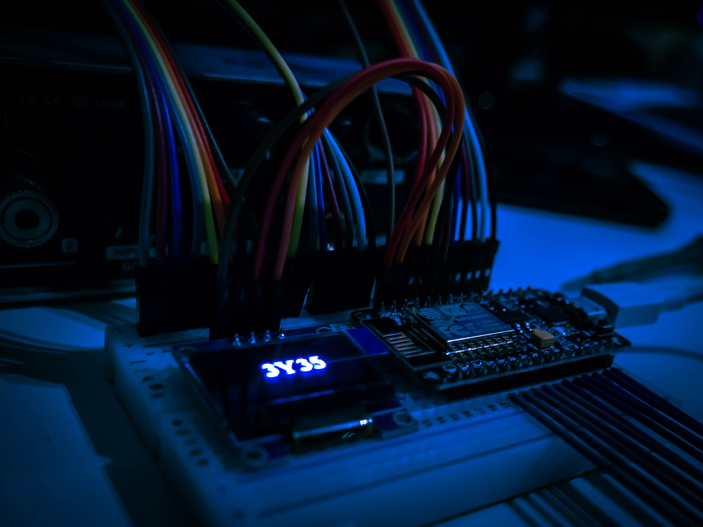
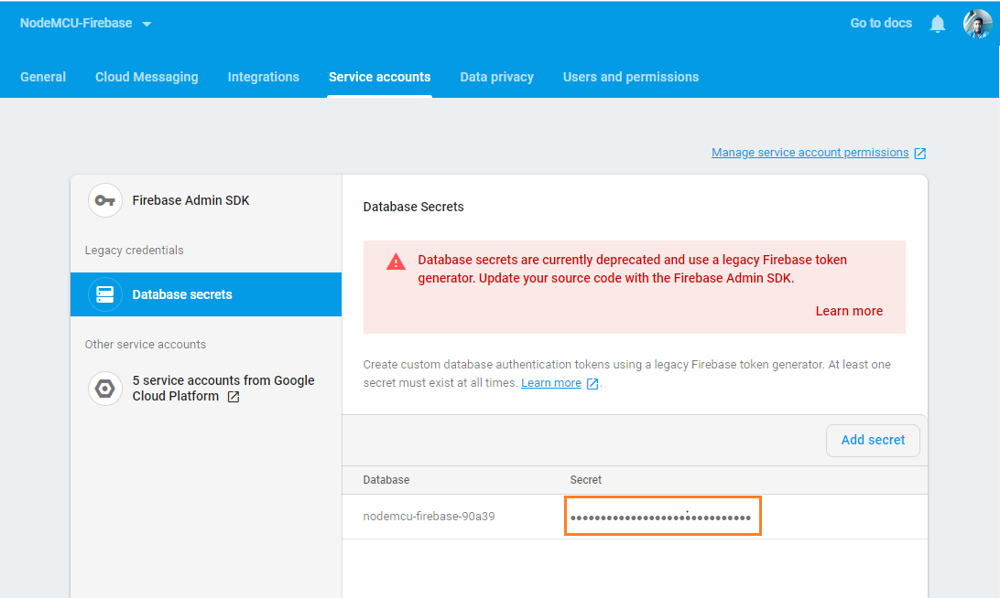
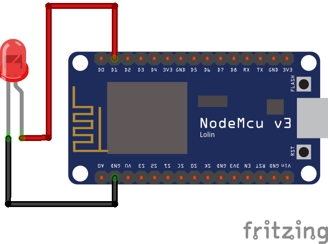

<center><small>Photo by Tim Käbel on Unsplash</small></center>

<blockquote>
   <em>
      The Internet will disappear. There will be so many IP addresses, so many devices, sensors, things that you are wearing, things that you are interacting with, that you won't even sense it. It will be part of your presence all the time. Imagine you walk into a room, and the room is dynamic. And with your permission and all of that, you are interacting with the things going on in the room.
   </em>
   <cite>Eric Schmidt</cite>
</blockquote>

Nowadays many devices that we use day to day are connected to the internet like Television, smart speakers, refrigerators, etc. These devices extend their primary functions and allow it to interact with other devices on the internet and allow them to be controlled remotely.

You can build your own IoT devices using some sensors and microcontrollers. There are many development boards that will help you get started with IoT like Arduino, Nodemcu, Raspberry Pi, etc. You can automate your home by building from these devices.

In this post, we will be using NodeMCU devkit and Firebase for turning on and off led remotely. NodeMCU devkit and Firebase are the best combinations to get started with building some IoT projects. NodeMCU is cheap and has built-in wifi for internet connectivity and also Firebase free plan is more than enough.

## Setting up Development Environment

1. We will be using Arduino IDE for writing code and flash the code to the device. Download the latest version of the IDE [here](https://www.arduino.cc/en/main/software).

2. Since we are using NodeMCU which is not officially supported by Arduino IDE, we have to add the JSON file of the device. In Arduino IDE add this URL in
<div class="code-line">
   Open File > Preferences > Additional Board Manager URLs
   <span style="text-decoration: underline">
      http://arduino.esp8266.com/stable/package_esp8266com_index.json
   </span>
</div>


3. Select your Board from
<div class="code-line">
Tools > Board > NodeMCU 1.o
</div>

4. To use firebase database in NodeMCU you need to download the firebase-arduino library which abstracts the REST API of the firebase. Download [Download firebase-arduino](https://github.com/FirebaseExtended/firebase-arduino.git)

5. Include the downloaded zip file on Arduino IDE.
<div class="code-line">
Sketch > Include library > Add .zip > Select zip file
</div>

6. You also need to install the ArduinoJson library which can be downloaded from Arduino IDE itself.
   <br>
   Note: The library version should not be 6.x.x use the latest 5.x.x
   <div class="code-line">
   Sketch > Include library > Manage Libraries > Search for ArduinoJson by Benoit Blanchon
   </div>

## Setting up Firebase Database

7. Create a new firebase project from the [console](https://console.firebase.google.com/) and head towards the database section and select firebase realtime database.

8. Copy database secret for authetication from settings panel > Service accounts.



9. Add a led node to the firebase database. This value will decide whether to turn or off LED.


## Configuring Arduino IDE and firebase database to work together
10. Now all the setup procedures are done let's start coding. <br>
You need to create a macro for your database URL and firebase secret which you had copied in Step 8.

<div class="code-line">
#define FIREBASE_HOST "yourfirebasedatabase.firebaseio.com"
#define FIREBASE_AUTH "*****"
</div>

<br>
For simplicity, we will write a simple code for turning on and off led remotely

```cpp
#include <ESP8266WiFi.h>
#include <FirebaseArduino.h>

// Firebase
#define FIREBASE_HOST "yourfirebasedatabase.firebaseio.com"
#define FIREBASE_AUTH "*****"

// Wifi Connection Details
#define WIFI_SSID "your_wifi_ssid"
#define WIFI_PASSWORD "your_wifi_password"

const int led = D1;

void setup()
{
  Serial.begin(115200);
  pinMode(led, OUTPUT);

  // connecting to wifi.
  WiFi.begin(WIFI_SSID, WIFI_PASSWORD);
  Serial.println("connecting...");
  while (WiFi.status() != WL_CONNECTED)
  {
    Serial.println(".");
    delay(3000);
  }
  Serial.println(WiFi.localIP());

  //  Setting up connection to firebase
  Firebase.begin(FIREBASE_HOST, FIREBASE_AUTH);
}

void loop()
{
   bool isLedOn = Firebase.getBool("/led");
   if (isLedOn) {
      digitalWrite(led, HIGH);
   }
   else {
      digitalWrite(led, LOW);
   }
   delay(1000);
}
```

11. The positive of the LED should be connected to the D1 pin and negative pin to the ground pin of NodeMCU.



12.  Upload your code from Arduino IDE.
<div class="code-line">
Sketch > Upload
</div>

13. Now try changing the database value to true and false the led should now start turn on and off. Additionally, you can extend this project by creating a web app that will toggle the LED instead of manually changing the value in the database.

So now you understood the basics of how to go about connecting NodeMCU to the internet and control it remotely, start hacking some new projects with it.
